# Animation specifications

Generated from `assets/js/motion-registry.js` by `node source/lottie/gen_specs.js`. Do not edit by hand.

Every animation is labeled by what it actually is:

- **Lottie**: hand-authored Lottie JSON, built by `source/lottie/build.py` (light and dark files, identical keyframes).
- **Lottie, progress-mapped**: a Lottie whose timeline is linear in one value; the app eases to the frame that equals real state.
- **SVG + JS, data-bound**: drawn from data by `assets/js/keel-charts.js`, because a keyframed file can't hold exact values.

Rive: Keel’s four state machines are specified, not authored; one CC BY community toggle runs in the Rive runtime on the case study. See [rive-spec.md](rive-spec.md).

| # | Animation | Technology | Trigger | Timing | Loop | Files |
| --- | --- | --- | --- | --- | --- | --- |
| 01 | Hero Equilibrium | Lottie | Plays once when 35% of it is in view. Holds the final frame. Replay on request. | 4.0s at 60fps: rocking 0 to 2.5s, ember 1.6 to 2.6s, hold to 4.0s | No | `equilibrium.json` (13.9 KB), dark 13.8 KB, fallback `equilibrium.svg` |
| 02 | The Equilibrium Line | Lottie, progress-mapped | When the Steady screen opens; again whenever spending changes. | 0.6s intro, then a 0.9s settle to the value; later changes 0.52s | No | `line.json` (7.5 KB), dark 7.5 KB, fallback `line.svg` |
| 03 | Financial Clarity Reveal | Lottie | Plays once in view. | 3.6s: rows settle 0.5 to 2.0s, baseline and axis 1.6 to 2.7s, focus 2.5 to 3.1s | No | `clarity.json` (16.3 KB), dark 16.3 KB, fallback `clarity.svg` |
| 04 | Spending Insight | SVG + JS, data-bound | Opening Spending; saving a new category; filtering. | 0.52s (--dur-chart); 40ms stagger on first reveal | No | `keel-charts.js` |
| 05 | Savings Goal Progress | Lottie, progress-mapped | Goals opens; money is added. | 0.9s settle to the value; completion 1.0s | No | `goal.json` (5.9 KB), dark 5.8 KB, fallback `goal.svg` |
| 06 | Successful Transaction Update | Lottie | The category is saved. | 0.75s, plays once | No | `check.json` (1.9 KB), dark 1.9 KB, fallback `check.svg` |
| 07 | Empty Transaction State | Lottie | Plays once when the empty state comes into view. | 2.2s, plays once, holds | No | `empty.json` (5.7 KB), dark 5.6 KB, fallback `empty.svg` |
| 08 | Financial Goal Created | Lottie | The goal is created. | 2.2s, plays once, holds | No | `goal-created.json` (8.1 KB), dark 8.0 KB, fallback `goal-created.svg` |
| 09 | Weekly Financial Summary | SVG + JS, data-bound | Opening Spending. | 0.52s per bar, 60ms stagger, about 0.9s total | No | `keel-charts.js` |
| 10 | Upcoming Expenses | SVG + JS, data-bound | Opening Steady; any bill or payday change. | About 0.9s | No | `keel-charts.js` |
| 11 | Loading | Lottie | Only while waiting. Never shown for a fake delay. | 1.6s loop | Yes, only while loading | `loading.json` (5.8 KB), dark 5.8 KB, fallback `loading.svg` |
| 12 | Financial Scenario Comparison | SVG + JS, data-bound | Moving the slider; applying the plan. | 0.52s | No | `keel-charts.js` |
| 13 | Onboarding Transition | Lottie | Each step change. | 1.0s per segment | No | `onboarding.json` (15.9 KB), dark 15.9 KB, fallback `onboarding.svg` |
| 14 | Brand Signature | Lottie | Plays once in view. | 3.0s | No | `signature.json` (15.2 KB), dark 15.2 KB, fallback `signature.svg` |
| 15 | Completion | Lottie | Money added to a goal; a plan applied. | 1.4s, holds | No | `complete.json` (7.8 KB), dark 7.8 KB, fallback `complete.svg` |
| 16 | The Keel (from version 1) | Lottie | Welcome screen opens; in view in the case study. | 5.0s, plays once, holds | No | `keel-settle.json` (10.7 KB), dark 10.7 KB, fallback `keel-settle.svg` |

## 01 · Hero Equilibrium

**Lottie** · Principles: Settle, Reassure · Where: Case study hero, motion system page

- **Problem.** The idea behind Keel (steadiness, not restriction) is abstract. People need to feel it before they read it.
- **Design intention.** A balance object starts slightly off level, finds its balance, and holds. The last thing to move is the ember: the person, settling into a steady position.
- **Motion behavior.** The beam rocks with decaying swings (each keeps about 45% of the last) while the right-hand mass slides into its balanced place. The ember lowers onto the pivot last. Then stillness.
- **Trigger.** Plays once when 35% of it is in view. Holds the final frame. Replay on request.
- **Timing.** 4.0s at 60fps: rocking 0 to 2.5s, ember 1.6 to 2.6s, hold to 4.0s
- **Easing.** Pendulum swing between extremes, cubic-bezier(0.45, 0, 0.55, 1); the ember on --ease-settle
- **Accessibility.** role="img" with a description. Reduced motion shows the settled final frame. Never loops.
- **Implementation.** `<keel-lottie name="equilibrium" trigger="inview" poster="end" label="..."></keel-lottie>`

### Storyboard

Frames of the shipped file, rendered headless (light theme).

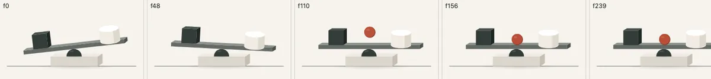

| Frame | State | What happens |
| --- | --- | --- |
| 0 | Off level | The beam tips left; the porcelain mass sits too far out. |
| 48 | Response | The beam swings past level; the mass begins to slide in. |
| 110 | Balance | Swings shrink; the mass reaches its place. |
| 156 | Focal | The ember lowers onto the pivot. |
| 239 | Hold | Everything at rest. |

Initial state: frame 0. Final state: frame 239. User benefit: A balance object starts slightly off level, finds its balance, and holds. The last thing to move is the ember: the person, settling into a steady position.

## 02 · The Equilibrium Line

**Lottie, progress-mapped** · Principles: Settle, Explain · Where: Steady screen: spending pace since payday

- **Problem.** A number like $306 in 7 days means nothing without a reference. People need to know whether this stretch is normal.
- **Design intention.** A baseline with “your usual” at the center. A marker travels along it and settles where your actual pace is: left is lighter than usual, right is heavier. No red, no warning.
- **Motion behavior.** Frames 0 to 36 draw the baseline from the center out. Frames 36 to 136 are linear in the value. The app eases the marker to the frame that equals spent ÷ usual for the days since payday.
- **Trigger.** When the Steady screen opens; again whenever spending changes.
- **Timing.** 0.6s intro, then a 0.9s settle to the value; later changes 0.52s
- **Easing.** --ease-settle on the scrub. The timeline itself is linear so position equals value.
- **Accessibility.** The sentence next to it states the same fact in words (“$30 lighter than usual”). The element has an aria-label with the percentage.
- **Implementation.** `line.scrubTo((spent / usual) - 0.5, { from: 36, to: 136 })`

### Storyboard

Frames of the shipped file, rendered headless (light theme).

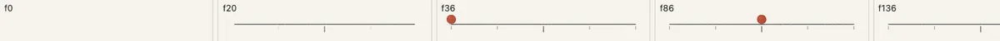

| Frame | State | What happens |
| --- | --- | --- |
| 0 | Empty | Nothing yet. |
| 20 | Baseline | The line draws out from “your usual”. |
| 36 | Scale | Ticks in place; the marker appears at the start. |
| 86 | Usual | Halfway: exactly your usual pace. |
| 136 | Range end | The far right of the scale. |

Initial state: frame 0. Final state: frame 136. User benefit: A baseline with “your usual” at the center. A marker travels along it and settles where your actual pace is: left is lighter than usual, right is heavier. No red, no warning.

## 03 · Financial Clarity Reveal

**Lottie** · Principles: Reveal · Where: Case study, the problem

- **Problem.** The difference between “overwhelming” and “clear” is easier to show than to describe, without inventing screenshots of real products.
- **Design intention.** Abstract marks (bars, dots, figures) start scattered and rotated, then drift into a ranked list on a baseline, figures right-aligned, the ember marking the row that matters.
- **Motion behavior.** Each row arrives 8 frames after the one above. The baseline and axis draw in once the order is clear. The ember is last.
- **Trigger.** Plays once in view.
- **Timing.** 3.6s: rows settle 0.5 to 2.0s, baseline and axis 1.6 to 2.7s, focus 2.5 to 3.1s
- **Easing.** --ease-settle throughout
- **Accessibility.** Decorative to the argument, so the paragraph beside it carries the meaning. Reduced motion shows the organized end state.
- **Implementation.** `<keel-lottie name="clarity" trigger="inview" poster="end"></keel-lottie>`

### Storyboard

Frames of the shipped file, rendered headless (light theme).

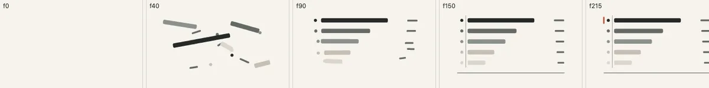

| Frame | State | What happens |
| --- | --- | --- |
| 0 | Before | Nothing. |
| 40 | Scattered | Bars, dots and figures at odd angles. |
| 90 | Aligning | Rows find their places. |
| 150 | Structure | Baseline and axis draw in. |
| 215 | Clear | The ember marks the row that matters. |

Initial state: frame 0. Final state: frame 215. User benefit: Abstract marks (bars, dots, figures) start scattered and rotated, then drift into a ranked list on a baseline, figures right-aligned, the ember marking the row that matters.

## 04 · Spending Insight

**SVG + JS, data-bound** · Principles: Explain, Connect · Where: Spending screen: by category

- **Problem.** When a transaction moves between categories, two totals change at once. If the bars jump, people miss what happened.
- **Design intention.** Bars move from their old values to their new ones, so the change itself is visible. A tick marks where each category stood by this point last stretch.
- **Motion behavior.** Widths are scaleX transforms of exact ratios (value ÷ largest value). Amounts count to the new figure in the same time. First visit reveals the bars in sequence.
- **Trigger.** Opening Spending; saving a new category; filtering.
- **Timing.** 0.52s (--dur-chart); 40ms stagger on first reveal
- **Easing.** --ease-standard, cubic-bezier(0.4, 0, 0.2, 1): a change in place, not an arrival
- **Accessibility.** Each row is a button whose label states the amount and the comparison in words. Color is never the only signal: the selected row is also bold and pressed.
- **Implementation.** `KeelCharts.bars(el, rows, { selected })`

## 05 · Savings Goal Progress

**Lottie, progress-mapped** · Principles: Explain, Settle, Reassure · Where: Goals: every goal card

- **Problem.** Progress bars are everywhere and say nothing. Adding money should feel like weight being placed, and finishing should feel finished, without confetti.
- **Design intention.** An ink ballast fills a mineral well while an ember block rides its leading edge. At 100%, the block lowers into a seat at the end of the well and a capstone line closes the structure.
- **Motion behavior.** Frames 0 to 200 are linear in progress. The app eases to saved ÷ target × 200. Only at 100% does it play the completion segment, 200 to 260.
- **Trigger.** Goals opens; money is added.
- **Timing.** 0.9s settle to the value; completion 1.0s
- **Easing.** --ease-settle on the scrub; settle inside the completion segment
- **Accessibility.** aria-label states saved, target and percent. The figures above it say the same in text.
- **Implementation.** `goal.scrubTo(saved / target, { from: 0, to: 200 }); if done: goal.playSegment(200, 259)`

### Storyboard

Frames of the shipped file, rendered headless (light theme).

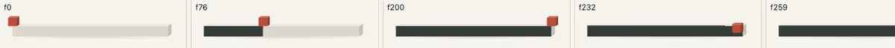

| Frame | State | What happens |
| --- | --- | --- |
| 0 | Empty | The ember block waits at the start of the well. |
| 76 | 38% | The sample goal today: $380 of $1,000. |
| 200 | Full | The well is filled. |
| 232 | Seated | The block lowers into place. |
| 259 | Closed | A capstone line completes the structure. |

Initial state: frame 0. Final state: frame 259. User benefit: An ink ballast fills a mineral well while an ember block rides its leading edge. At 100%, the block lowers into a seat at the end of the well and a capstone line closes the structure.

## 06 · Successful Transaction Update

**Lottie** · Principles: Respond, Reassure · Where: Transaction sheet, after changing a category

- **Problem.** Saving a category is a small action. It needs a clear “done” without a celebration.
- **Design intention.** An ember ring draws, an ink check follows, and the mark settles from 92% to full size. Then the bars behind the sheet move to show the consequence.
- **Motion behavior.** Ring trim 0 to 0.4s; check trim from 0.2 to 0.57s; scale settles over 0.6s.
- **Trigger.** The category is saved.
- **Timing.** 0.75s, plays once
- **Easing.** --ease-settle
- **Accessibility.** The heading “Moved to Groceries” and a polite live-region announcement carry the confirmation. Focus moves to Done.
- **Implementation.** `sheet.querySelector('keel-lottie[name=check]').replay()`

### Storyboard

Frames of the shipped file, rendered headless (light theme).

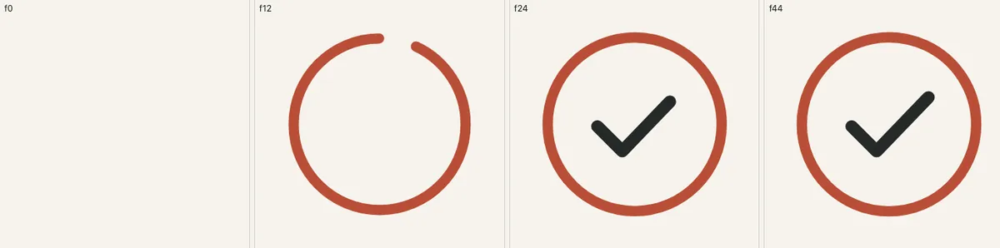

| Frame | State | What happens |
| --- | --- | --- |
| 0 | Start | Nothing. |
| 12 | Ring | The ring is drawing. |
| 24 | Check | The check follows. |
| 44 | Done | At rest, full size. |

Initial state: frame 0. Final state: frame 44. User benefit: An ember ring draws, an ink check follows, and the mark settles from 92% to full size. Then the bars behind the sheet move to show the consequence.

## 07 · Empty Transaction State

**Lottie** · Principles: Reassure · Where: Spending: a category with no transactions (Travel)

- **Problem.** An empty list can read as “something’s missing” or “you did it wrong”.
- **Design intention.** A porcelain platform rises onto a ground line and a small ember settles on it: ready, not missing. The copy says the same: nothing’s wrong.
- **Motion behavior.** Ground line draws, platform rises 18px into place, the ember lowers last and its contact shadow firms up.
- **Trigger.** Plays once when the empty state comes into view.
- **Timing.** 2.2s, plays once, holds
- **Easing.** --ease-settle
- **Accessibility.** role="img" with a description; the heading and sentence carry the meaning.
- **Implementation.** `<keel-lottie name="empty" trigger="inview" poster="end"></keel-lottie>`

### Storyboard

Frames of the shipped file, rendered headless (light theme).

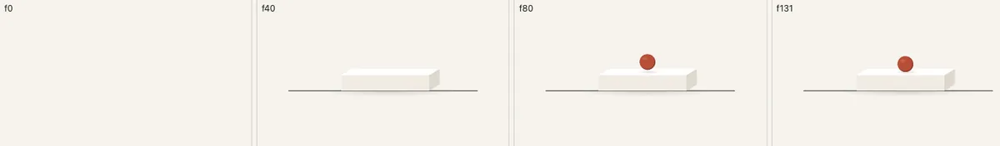

| Frame | State | What happens |
| --- | --- | --- |
| 0 | Empty | Nothing. |
| 40 | Platform | The platform rises into place. |
| 80 | Arriving | The ember lowers. |
| 131 | Ready | Resting, waiting for the first entry. |

Initial state: frame 0. Final state: frame 131. User benefit: A porcelain platform rises onto a ground line and a small ember settles on it: ready, not missing. The copy says the same: nothing’s wrong.

## 08 · Financial Goal Created

**Lottie** · Principles: Reassure, Settle · Where: New goal sheet, after “Set this goal”

- **Problem.** Creating a goal is a commitment. It deserves a moment, but not fireworks.
- **Design intention.** Three blocks arrive from alternating sides and stack into a stepped structure; the ember cap lowers last. A goal is a foundation being laid.
- **Motion behavior.** Basalt base, slate middle, porcelain top, each 20 frames apart, alternating left and right. Ember cap from 1.3s.
- **Trigger.** The goal is created.
- **Timing.** 2.2s, plays once, holds
- **Easing.** --ease-settle
- **Accessibility.** The heading names the goal; a live-region announcement confirms it. Focus moves to the next action.
- **Implementation.** `sheet.querySelector('keel-lottie[name=goal-created]').replay()`

### Storyboard

Frames of the shipped file, rendered headless (light theme).

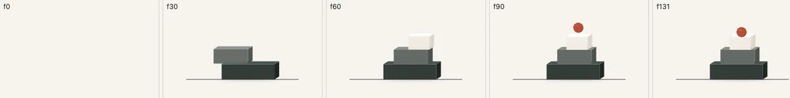

| Frame | State | What happens |
| --- | --- | --- |
| 0 | Empty | Ground line only. |
| 30 | Base | The basalt base settles. |
| 60 | Middle | The slate block arrives from the left. |
| 90 | Top | The porcelain block from the right; the cap appears. |
| 131 | Set | The cap rests on top. |

Initial state: frame 0. Final state: frame 131. User benefit: Three blocks arrive from alternating sides and stack into a stepped structure; the ember cap lowers last. A goal is a foundation being laid.

## 09 · Weekly Financial Summary

**SVG + JS, data-bound** · Principles: Reveal, Explain · Where: Spending: day by day; lifecycle email preview

- **Problem.** A week of spending is a sequence. Shown all at once it’s a block of numbers.
- **Design intention.** Days rise in order, left to right, against a dashed line for a usual day. Today is the one ember bar.
- **Motion behavior.** Bar heights are exact; each rises from the baseline with a 60ms stagger.
- **Trigger.** Opening Spending.
- **Timing.** 0.52s per bar, 60ms stagger, about 0.9s total
- **Easing.** --ease-settle
- **Accessibility.** role="img" with a description listing every day’s total; the header gives the week total in text.
- **Implementation.** `KeelCharts.week(svg, { days, usual: 48, today })`

## 10 · Upcoming Expenses

**SVG + JS, data-bound** · Principles: Reveal, Orient · Where: Steady screen: coming up

- **Problem.** A list of bills doesn’t show how close together they are, or which one is next.
- **Design intention.** A timeline draws from today. Bills appear in order as quiet ink dots; payday is a post with an ember pennant; the next bill arrives last, larger, in ember, with its name.
- **Motion behavior.** Line draws (0.52s), marks fade and settle 4px with 60ms stagger, emphasis last.
- **Trigger.** Opening Steady; any bill or payday change.
- **Timing.** About 0.9s
- **Easing.** --ease-settle
- **Accessibility.** role="img" with a description listing every bill; the list below repeats it in full text with “Next” as a word.
- **Implementation.** `KeelCharts.timeline(svg, { today, payday, bills })`

## 11 · Loading

**Lottie** · Principles: Respond, Reassure · Where: App boot if fonts take over 300ms; the case study’s prototype frame while it loads

- **Problem.** Waiting with no sign of life feels broken; a long decorative loader feels like the wait is the product.
- **Design intention.** Three small blocks on a line drift a few pixels out of level and settle back, in turn. Quiet, short, and only while something is actually loading.
- **Motion behavior.** The loop has no visible join: each block lifts 7px and settles, 10 frames after the previous one.
- **Trigger.** Only while waiting. Never shown for a fake delay.
- **Timing.** 1.6s loop
- **Easing.** --ease-lift up, --ease-settle down
- **Accessibility.** Paired with visible text (“Loading Keel”). Reduced motion shows a still frame with the same text.
- **Implementation.** `<keel-lottie name="loading" loop></keel-lottie>`

### Storyboard

Frames of the shipped file, rendered headless (light theme).

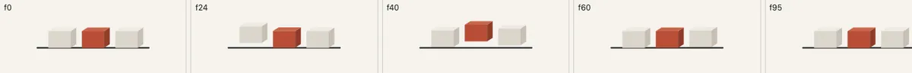

| Frame | State | What happens |
| --- | --- | --- |
| 0 | Level | All three at rest. |
| 24 | Lift | The first block rises. |
| 40 | Ember | The middle block rises. |
| 60 | Settle | The last block rises as the first lands. |
| 95 | Level | Back where it started: the loop point. |

Initial state: frame 0. Final state: frame 95. User benefit: Three small blocks on a line drift a few pixels out of level and settle back, in turn. Quiet, short, and only while something is actually loading.

## 12 · Financial Scenario Comparison

**SVG + JS, data-bound** · Principles: Explain, Connect · Where: Plan screen

- **Problem.** “Save $100 more each paycheck” is easy to say and hard to picture.
- **Design intention.** Two step lines over six months: the current plan dashed, the change in ember. When the slider moves, the ember path moves to the new totals, so the consequence is visible as a shape.
- **Motion behavior.** Every step is a real paycheck date and a real total. The path interpolates point by point from the previous scenario to the new one.
- **Trigger.** Moving the slider; applying the plan.
- **Timing.** 0.52s
- **Easing.** --ease-standard
- **Accessibility.** A visually hidden table lists the same numbers; the readouts say the outcome in sentences; the range input is a native slider with a label.
- **Implementation.** `KeelCharts.scenario(svg, series, { from: previous })`

## 13 · Onboarding Transition

**Lottie** · Principles: Connect, Orient · Where: Onboarding: accounts, bills, payday

- **Problem.** Three setup steps feel like three forms. The point is that each answer builds the same picture.
- **Design intention.** One equilibrium object stays on screen across the steps and changes with each message: your money lands, the bills stack on, the shore extends to payday and the beam levels, and the ember settles when the reading is ready.
- **Motion behavior.** Four one-second segments with markers. Going back plays the previous segment in reverse, so the object undoes exactly what the step added.
- **Trigger.** Each step change.
- **Timing.** 1.0s per segment
- **Easing.** Swing as the beam tips, --ease-settle as things land
- **Accessibility.** Decorative (aria-hidden): every step’s words carry the meaning. Reduced motion jumps to each segment’s end.
- **Implementation.** `onb.playSegment(from, to)  // from > to plays backwards`
- **Segments.** Accounts 0 to 60, Bills 60 to 120, Payday 120 to 180, Ready 180 to 240

### Storyboard

Frames of the shipped file, rendered headless (light theme).

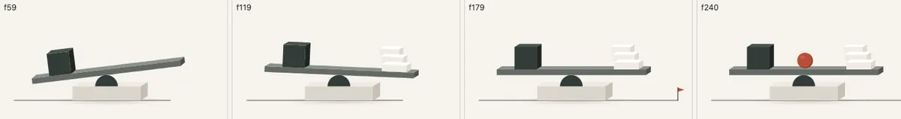

| Frame | State | What happens |
| --- | --- | --- |
| 59 | Accounts | What you have: the basalt mass lands and the beam tips. |
| 119 | Bills | What’s spoken for: three bills stack on the right. |
| 179 | Payday | The shore: the ground extends to a payday post, the beam levels. |
| 240 | Ready | The ember settles on the pivot. |

Initial state: frame 59. Final state: frame 240. User benefit: One equilibrium object stays on screen across the steps and changes with each message: your money lands, the bills stack on, the shore extends to payday and the beam levels, and the ember settles when the reading is ready.

## 14 · Brand Signature

**Lottie** · Principles: Settle, Orient · Where: Case study, visual identity

- **Problem.** A static logo explains nothing about how the brand moves.
- **Design intention.** A thin waterline draws across. The hull drops onto it, the keel extends below, and the wordmark rises into place letter by letter. The identity, assembled by its own logic.
- **Motion behavior.** The wordmark is the real Fraunces outline (extracted with fontTools, so no font loads inside the animation).
- **Trigger.** Plays once in view.
- **Timing.** 3.0s
- **Easing.** --ease-settle
- **Accessibility.** role="img" labeled “Keel”. Reduced motion shows the final lockup.
- **Implementation.** `<keel-lottie name="signature" trigger="inview" poster="end" label="Keel"></keel-lottie>`

### Storyboard

Frames of the shipped file, rendered headless (light theme).

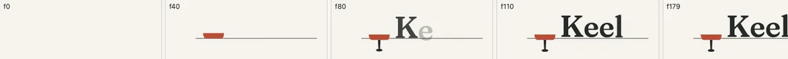

| Frame | State | What happens |
| --- | --- | --- |
| 0 | Empty | Nothing. |
| 40 | Line | The waterline draws; the hull drops. |
| 80 | Keel | The keel extends; letters begin. |
| 110 | Wordmark | Letters rise in turn. |
| 179 | Lockup | Complete. |

Initial state: frame 0. Final state: frame 179. User benefit: A thin waterline draws across. The hull drops onto it, the keel extends below, and the wordmark rises into place letter by letter. The identity, assembled by its own logic.

## 15 · Completion

**Lottie** · Principles: Reassure, Settle · Where: Goals (money added) and Plan (plan applied)

- **Problem.** Confirmations get lost. A recognizable mark makes “that worked” instant.
- **Design intention.** Two posts rise, a lintel lowers across them, and the ember keystone slides into place last. A small finished structure.
- **Motion behavior.** Posts scale up from the ground, lintel drops 26px, keystone slides 40px.
- **Trigger.** Money added to a goal; a plan applied.
- **Timing.** 1.4s, holds
- **Easing.** --ease-settle
- **Accessibility.** Always paired with a sentence in a live region (“Added $50. Steady through Oct 24.”).
- **Implementation.** `confirm.querySelector('keel-lottie[name=complete]').replay()`

### Storyboard

Frames of the shipped file, rendered headless (light theme).

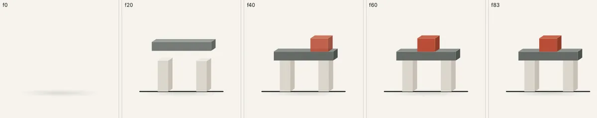

| Frame | State | What happens |
| --- | --- | --- |
| 0 | Ground | Nothing yet. |
| 20 | Posts | Two posts rise. |
| 40 | Lintel | The lintel lowers on. |
| 60 | Keystone | The ember slides in. |
| 83 | Done | At rest. |

Initial state: frame 0. Final state: frame 83. User benefit: Two posts rise, a lintel lowers across them, and the ember keystone slides into place last. A small finished structure.

## 16 · The Keel (from version 1)

**Lottie** · Principles: Settle · Where: App welcome screen; case study illustration section

- **Problem.** The product’s name needs a picture: what does a keel actually do?
- **Design intention.** A boat drawn as a cutaway so the keel shows below the waterline. It rocks and settles level: the hidden thing made visible.
- **Motion behavior.** Heels 9°, swings with decaying amplitude around the center of buoyancy, within half a degree of level by 3s and still by 3.7s, then holds.
- **Trigger.** Welcome screen opens; in view in the case study.
- **Timing.** 5.0s, plays once, holds
- **Easing.** Pendulum swing
- **Accessibility.** role="img" with a description; reduced motion shows the level boat.
- **Implementation.** `<keel-lottie name="keel-settle" poster="end"></keel-lottie>`

### Storyboard

Frames of the shipped file, rendered headless (light theme).

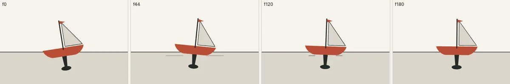

| Frame | State | What happens |
| --- | --- | --- |
| 0 | Heeled | 9° over. |
| 44 | Swing | Past level the other way. |
| 120 | Settling | Small swings. |
| 180 | Level | At rest. |

Initial state: frame 0. Final state: frame 180. User benefit: A boat drawn as a cutaway so the keel shows below the waterline. It rocks and settles level: the hidden thing made visible.
